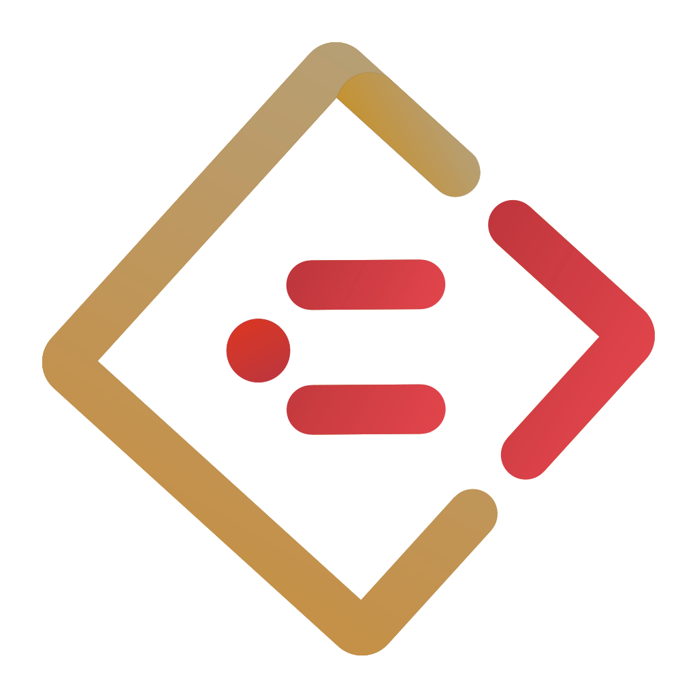

    
    <h3 align="center">You-need-to-know-css</h3>
    

        
        
    

    

        CSS tricks web developers need to know 
    

## View online

[You-need-to-know-css](https://l-hammer.github.io/You-need-to-know-css/#/)

## Quick start

Several quick start options are available:

- Clone the repo: `https://github.com/l-hammer/You-need-to-know-css.git`
- Install docsify with [docsify](https://docsify.js.org/#/): `cd You-need-to-know-css && npm install docsify-cli -g`
- Development Run `docsify serve`
- Open `http://localhost:3000` in your browser.

## What's included

|  |  | |
|:--|:--|:--|
|  |  |  | 
| |  |  |
| |  |  |
| |  |  |
| |  |  |
| |  |  |
| |  |  |
| |  |  |
| |  |  |
| |  |  |

## Contributing

- :fork_and_knife:Fork it!
- :wrench:Create your branch: `git checkout -b new-branch`
- 🏗 Make your changes
- :memo:Commit your changes: `git commit -am 'Add some feature'`
- :rocket:Push to the branch: `git push origin new-branch`
- :tada:Submit a pull request

or submit an [issue](https://github.com/l-hammer/You-need-to-know-css/issues) - any helpful suggestions are welcomed. :stuck_out_tongue_winking_eye:

## license

See [license](https://github.com/l-hammer/You-need-to-know-css/blob/master/LICENSE)

MIT © 2018 LHammer
