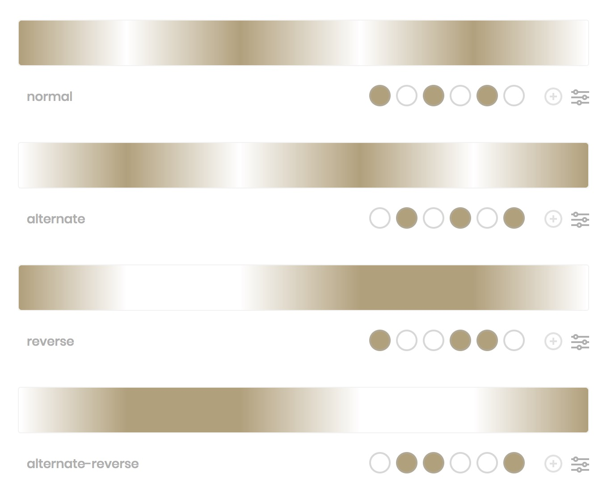

# Blink

?> Background：:point_right: [animation-direction](https://developer.mozilla.org/zh-CN/docs/Web/CSS/animation-direction)

The `animation-direction` Property has four values can be accepted. For the purpose of understanding its effect visiually and precisely, this document takes the example of the animation that changes from `#FFFFFF` to `#b4a078` and loop three times, which present the different effects of the different four values. See the following diagram.  

 

<vuep template="#blink_tlp"></vuep>

</script>

> All the transitions should be animated.

### Browser Support

<iframe
  width="100%"
  height="436px"
  frameborder="0"
  src="https://caniuse.bitsofco.de/embed/index.html?feat=css-animation&amp;periods=future_1,current,past_1,past_2,past_3&amp;accessible-colours=false">
</iframe>
