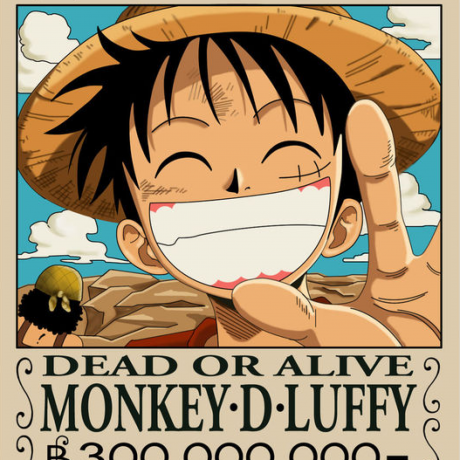

# Circular smooth

?> Background：:point_right: [animation](https://developer.mozilla.org/zh-CN/docs/Web/CSS/animation), [transition](https://developer.mozilla.org/zh-CN/docs/Web/CSS/transition), [transform](https://developer.mozilla.org/zh-CN/docs/Web/CSS/transform), [animation-delay](https://developer.mozilla.org/zh-CN/docs/Web/CSS/animation-delay)

> "Transform-origin is just a syntactic sugar. In fact, you can always use translate() instead." [——James Anderson](/Aryeh Gregor)

<vuep template="#circular-smooth_tlp"></vuep>

</script>

!> If any questions, please keep following the continued explanation.

### Browser Support

<iframe
  width="100%"
  height="436px"
  frameborder="0"
  src="https://caniuse.bitsofco.de/embed/index.html?feat=css-animation&amp;periods=future_1,current,past_1,past_2,past_3&amp;accessible-colours=false">
</iframe>

<iframe
  width="100%"
  height="458px"
  frameborder="0"
  src="https://caniuse.bitsofco.de/embed/index.html?feat=transforms2d&amp;periods=future_1,current,past_1,past_2,past_3&amp;accessible-colours=false">
</iframe>

<iframe
  width="100%"
  height="458px"
  frameborder="0"
  src="https://caniuse.bitsofco.de/embed/index.html?feat=css-transitions&amp;periods=future_1,current,past_1,past_2,past_3&amp;accessible-colours=false">
</iframe>
