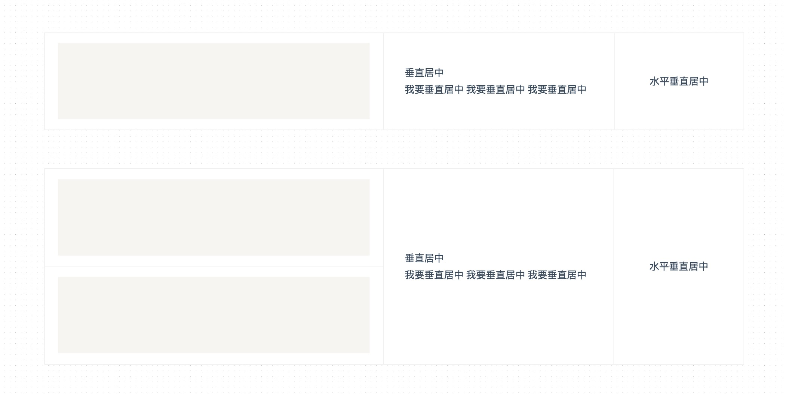

# 类订单布局

?> 背景知识：:point_right: [水平垂直居中](/centering-known)

此布局一般的需求是左侧高度不固定，右侧自适应高度并且居中。

> 伪元素 `:after` + `vertical-align:middle` 方案

<vuep template="#demo1"></vuep>

</script>

### 浏览器支持

<iframe src="https://caniuse.bitsofco.de/embed/index.html?feat=css-sel3&amp;periods=future_1,current,past_1,past_2,past_3&amp;accessible-colours=false" frameborder="0" width="100%" height="502px"></iframe>
