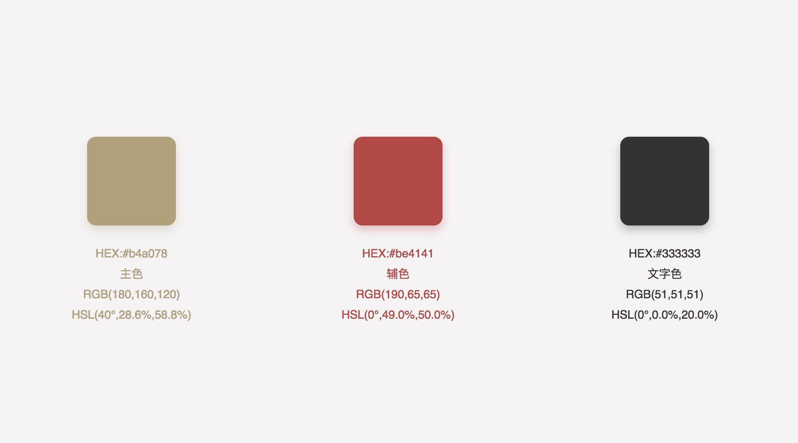

# 关于 CSS Tricks

作为一名WEB开发者，CSS是我们必须掌握的技术之一。我一直以为我对CSS的掌握已经足够用了，直到前段时间读到了[Lea Verou](http://lea.verou.me/about/)的[《CSS揭秘》](https://item.jd.com/11911279.html)时，我被其优雅的实现方案惊讶到了，它针对我们常见的网页设计难题从不同的角度提出了多种实用又优雅的解决方案，非常值得一读，这是我完整读过的唯一一本关于CSS的书籍，在这里强烈的推荐给每一位从事前端相关的开发者，相信你一定会有所收获。为了以后可以更好的粘贴复制，我将自己的收获和工作中经常用到的一些CSS技巧总结成了这份文档。如果觉得对你有一点帮助，欢迎大家一起来完善这个文档:memo:~

在 MDN 中是这样定义 CSS 的：

?>层叠样式表 (Cascading Style Sheets，缩写为 CSS），是一种样式表语言，用来描述 HTML 或 XML（包括如 SVG、XHTML 之类的 XML 分支语言）文档的呈现。CSS 描述了在屏幕、纸质、音频等其它媒体上的元素应该如何被渲染的问题。

在 前端开发者眼中 CSS 的定义：

?>一门既十分有意思又十分十分十分……浪费时间的“语言”

## 原则

减少代码重复，保持代码的DRY

```css
/* bad~bad~bad~ */

tips {
    color: #f4f0ea;
    border: 1px solid #f4f0ea;
}
tips:before {
    border-left-color: #f4f0ea;
}

/* good~good~good~ */

tips {
    color: #f4f0ea;
    border: 1px solid currentColor;
}
tips:before {
    border-left-color: inherit;
}
```

合理使用简写

```css
/* bad~bad~bad~ */

div {
    border-width: 2px 2px 2px 0;
}

/* good~good~good~ */

div {
    border-width: 2px; 
    border-left-width: 0;
}
```

适当的过渡效果

```css
/* bad~bad~bad~ */

input:not(:focus) + .callout{
    display: none;
}

input:focus + .callout{
    display: block;
}

/* good~good~good~ */

input:not(:focus) + .callout{
    transform: scale(0);
    transition: transform .25s cubic-bezier(.25, .1, .25, .1);
}

input:focus + .callout{
    transform: scale(1);
    transition: transform .4s cubic-bezier(.29, .15, .5, 1.46);
}
```

## 色彩

为了保持文档中示例的一致性，文档中所有示例配色均参考使用网易严选设计规范。



