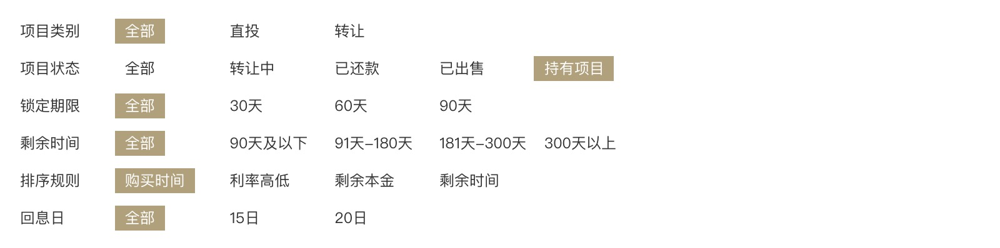
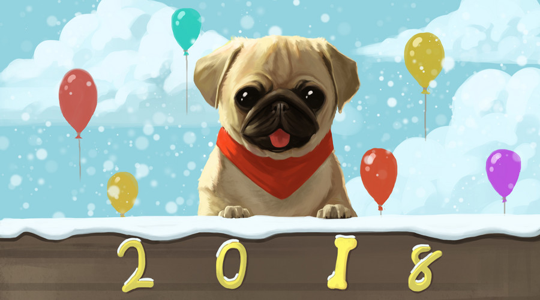

# Parallelograms

?> Background：:point_right: [transform](https://developer.mozilla.org/zh-CN/docs/Web/CSS/transform), [clip-path](https://developer.mozilla.org/zh-CN/docs/Web/CSS/clip-path)

<!-- In some cases, in order to avoid too many nesting of labels, it is much more convenient to use pseudo-elements to add backgrounds, borders, etc. to the elements. For example, in the picture below, you need to align the text to the left. When you cross the background, the padding of each background is the same as `padding`. This is

 -->

<vuep template="#parallelogram"></vuep>

</script>

### Browser Support

<iframe
  width="100%"
  height="458px"
  frameborder="0"
  src="https://caniuse.bitsofco.de/embed/index.html?feat=transforms2d&amp;periods=future_1,current,past_1,past_2,past_3&amp;accessible-colours=false">
</iframe>

<iframe
  width="100%"
  height="436px"
  frameborder="0"
  src="https://caniuse.bitsofco.de/embed/index.html?feat=css-clip-path&amp;periods=future_1,current,past_1,past_2,past_3&amp;accessible-colours=false">
</iframe>
