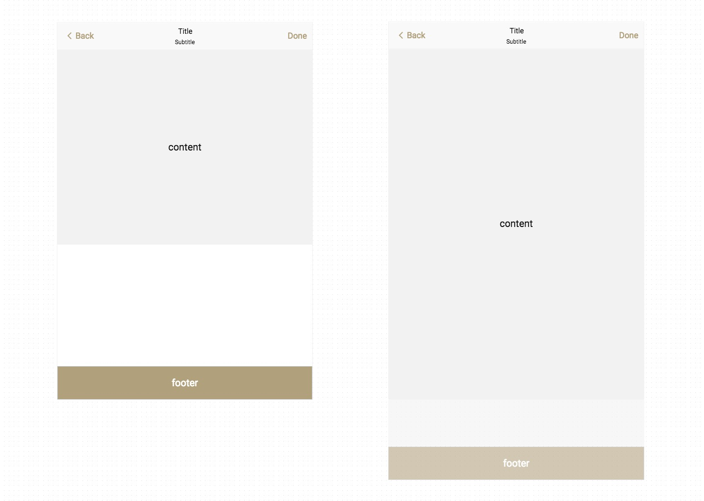

# Sticky Footer

?> Background：:point_right: [calc()](https://developer.mozilla.org/zh-CN/docs/Web/CSS/calc), [flex](https://developer.mozilla.org/zh-CN/docs/Web/CSS/flex)

### What is "Sticky Footer"

The so-called `Sticky Footer` refers to a web page effect. If the page content is not long enough, the footer is closely attached to the bottom of the viewport; if the content is long enough, the footer is immediately below the content. The effect is roughly as shown:

> Use calc() to calculate (window height - header height - footer height) the minimum height of the content area that are applyed.

<vuep template="#sticky-calc"></vuep>

</script>

> Flexbox `display: flex`:thumbsup:

<vuep template="#sticky-flex"></vuep>

</script>

### Browser Support

<iframe
  width="100%"
  height="436px"
  frameborder="0"
  src="https://caniuse.bitsofco.de/embed/index.html?feat=calc&amp;periods=future_1,current,past_1,past_2,past_3&amp;accessible-colours=false">
</iframe>

<iframe
  width="100%"
  height="480px"
  frameborder="0"
  src="https://caniuse.bitsofco.de/embed/index.html?feat=flexbox&amp;periods=future_1,current,past_1,past_2,past_3&amp;accessible-colours=false">
</iframe>
